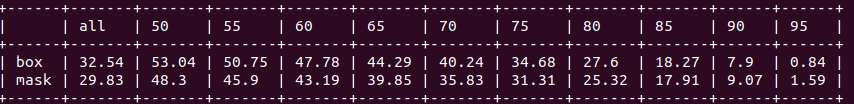

## Yolact_minimal
Minimal PyTorch implementation of [Yolact:《YOLACT: Real-time Instance Segmentation》](https://arxiv.org/abs/1904.02689).  
The original project is [here](https://github.com/dbolya/yolact).  

This implementation simplified the original code, preserved the main function and made the network easy to understand.  
This implementation has not been updated to Yolact++.  

### The network structure.  


## Environments  
PyTorch >= 1.1  
Python >= 3.6  
tensooardX  
Other common packages.  

## Prepare
- Build cython-nms  
```Shell
python build_stuff/setup.py build_ext --inplace
```
- Download COCO 2017 datasets, modify the root path in 'res101_coco' in `config.py`. 
- Download weights.

Yolact trained weights.  

|Backbone   | box mAP  | mask mAP  | Google Drive                                                                                                         |Baidu Cloud          |
|:---------:|:--------:|:---------:|:--------------------------------------------------------------------------------------------------------------------:|:----------------------------------------------------------------:|
|Resnet50   | 30.25    | 28.04     | [res50_coco_800000.pth](https://drive.google.com/file/d/1kMm0tBZh8NuXBLmXKzVhOKR98Hpd81ja/view?usp=sharing)  |[password: mksf](https://pan.baidu.com/s/1XDeDwg1Xw9GJCucJNqdNZw) |
|Resnet101  | 32.54    | 29.83     | [res101_coco_800000.pth](https://drive.google.com/file/d/1KyjhkLEw0D8zP8IiJTTOR0j6PGecKbqS/view?usp=sharing)      |[password: oubr](https://pan.baidu.com/s/1uX_v1RPISxgwQ2LdsbJrJQ) |

ImageNet pre-trained weights.  

| Backbone  | Google Drive                                                                                                    |Baidu Cloud                                                        |
|:---------:|:---------------------------------------------------------------------------------------------------------------:|:-----------------------------------------------------------------:|
| Resnet50  | [resnet50-19c8e357.pth](https://drive.google.com/file/d/1Uwz7BYHEmPuMCRQDW2wD00Jbeb-jxWng/view?usp=sharing)     | [password: a6ee](https://pan.baidu.com/s/1aFLE-e1KdH_FxRlisWzTHw) |
| Resnet101 | [resnet101_reducedfc.pth](https://drive.google.com/file/d/1vaDqYNB__jTB7_p9G6QTMvoMDlGkHzhP/view?usp=sharing)   | [password: kdht](https://pan.baidu.com/s/1ha4aH7xVg-0J0Ukcqcr6OQ) |


## Train
```Shell
# Train with resnet101 backbone on one GPU with a batch size of 8 (default).
python -m torch.distributed.launch --nproc_per_node=1 --master_port=$((RANDOM)) train.py --train_bs=8
# Train on multiple GPUs (i.e. two GPUs, 8 images per GPU).
export CUDA_VISIBLE_DEVICES=0,1
python -m torch.distributed.launch --nproc_per_node=2 --master_port=$((RANDOM)) train.py --train_bs=16
# Train with other configurations (res101_coco, res50_coco, res50_pascal, res101_custom, res50_custom, in total).
python -m torch.distributed.launch --nproc_per_node=1 --master_port=$((RANDOM)) train.py --cfg=res50_coco
# Train with different batch_size (freeze_bn will be set as True in `config.py` when the batch_size is smaller than 4).
python -m torch.distributed.launch --nproc_per_node=1 --master_port=$((RANDOM)) train.py --train_bs=4
# Train with different image size (anchor settings related to image size will be adjusted automatically).
python -m torch.distributed.launch --nproc_per_node=1 --master_port=$((RANDOM)) train.py --img_size=400
# Resume training with the latest trained model.
python -m torch.distributed.launch --nproc_per_node=1 --master_port=$((RANDOM)) train.py --resume latest
# Resume training with a specified model.
python -m torch.distributed.launch --nproc_per_node=1 --master_port=$((RANDOM)) train.py --resume latest_res101_coco_35000.pth
# Set evalution interval during training, set -1 to disable it.  
python -m torch.distributed.launch --nproc_per_node=1 --master_port=$((RANDOM)) train.py --val_interval 8000
```
## Use tensorboard
```Shell
tensorboard --logdir=tensorboard_log
```

## Evalution
```Shell
# Evaluate on COCO val2017 (configuration will be parsed according to the model name).
python eval.py --weight=weights/res101_coco_800000.pth
```
- The result should be:  


```Shell
# Evaluate with a specified number of images.
python eval.py --weight=weights/res101_coco_800000.pth --val_num=1000
# Evaluate with traditional nms.
python eval.py --weight=weights/res101_coco_800000.pth --traditional_nms
# Create a json file and then use the COCO API to evaluate the COCO detection result.
python eval.py --weight=weights/res101_coco_800000.pth --coco_api
```
## Detect
- detect result  

```Shell
# To detect images, pass the path of the image folder, detected images will be saved in `results/images`.
python detect.py --weight=weights/res101_coco_800000.pth --image=images
```
- cutout object  

```
# Use --cutout to cut out detected objects.
python detect.py --weight=weights/res101_coco_800000.pth --image=images --cutout
```
```
# To detect videos, pass the path of video, detected video will be saved in `results/videos`:
python detect.py --weight=weights/res101_coco_800000.pth --video=videos/1.mp4
# Use --real_time to detect real-timely.
python detect.py --weight=weights/res101_coco_800000.pth --video=videos/1.mp4 --real_time
```
- linear combination result  

```
# Use --hide_mask, --hide_score, --save_lincomb, --no_crop and so on to get different results.
python detect.py --weight=weights/res101_coco_800000.pth --image=images --save_lincomb
```

## Train on PASCAL_SBD datasets
- Download PASCAL_SBD datasets from [here](http://home.bharathh.info/pubs/codes/SBD/download.html), modify the path of the `img` folder in `data/config.py`.
- Then, generate a coco-style json.
```Shell
python utils/pascal2coco.py --folder_path=/home/feiyu/Data/pascal_sbd
```
- Download the Yolact trained weights.
[Google dirve](https://drive.google.com/file/d/1QHO_FEbsFJvN9_L4WZqCpKFtUre6iMVb/view?usp=sharing),   [Baidu Cloud: eg7b](https://pan.baidu.com/s/1KM5yV4IxHiAX4Iwn5G_TuA)

```Shell
# Training.
python -m torch.distributed.launch --nproc_per_node=1 --master_port=$((RANDOM)) train.py --cfg=res50_pascal
# Evalution.
python eval.py --weight=weights/res50_pascal_120000.pth
```

## Train custom datasets
- Install labelme  
```Shell
pip install labelme
```
- Use labelme to label your images, only ploygons are needed. The created json files are in the same folder with the images.  

- Prepare a 'labels.txt' like this, this first line: 'background' is always needed.  

- Prepare coco-style json, pass the paths of your image folder and the labels.txt. The 'custom_dataset' folder is a prepared example.  
```Shell
python utils/labelme2coco.py --img_dir=custom_dataset --label_name=cuatom_dataset/labels.txt
```
- Edit `CUSTOM_CLASSES` in `config.py`.  
  
Note that if there's only one class, the `CUSTOM_CLASSES` should be like `('dog', )`. The final comma is necessary to make it as a tuple, or the number of classes would be `len('dog')`.  
- Choose a configuration ('res101_custom' or 'res50_custom') in `config.py`, modify the corresponding `self.train_imgs` and `self.train_ann`. If you need to validate, prepare the validation dataset by the same way.  
- Then train.  
```Shell
python -m torch.distributed.launch --nproc_per_node=1 --master_port=$((RANDOM)) train.py --cfg=res101_custom
```
- Some parameters need to be taken care of by yourself:
1) Training batch size, try not to use batch size smaller than 4.
2) Anchor size, the anchor size should match with the object scale of your dataset.
3) Total training steps, learning rate decay steps and the warm up step, these should be decided according to the dataset size, overwrite `self.max_iter`, `self.decay_step`, `self.warmup_until` in your configuration.
4) If you encounter infinite loss, try a longer warm up step or use a smaller learning rate.