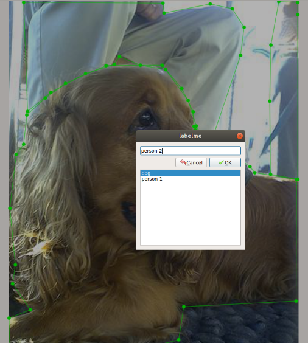
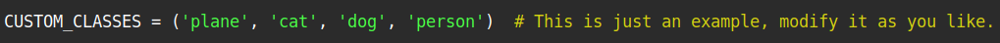
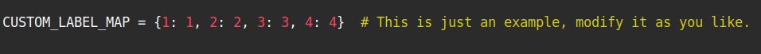

## Yolact_minimal
Minimal PyTorch implementation of [Yolact:《YOLACT: Real-time Instance Segmentation》](https://arxiv.org/abs/1904.02689).  
The original project is [here](https://github.com/dbolya/yolact).  

This implementation simplified the original code, preserved the main function and made the network easy to understand.   

Following instruction is based on resnet-101.  
### The network structure.  


## Environments  
PyTorch >= 1.1.  
Python >= 3.6.  
tensorboardX  
Other common packages.  

## Prepare
- Download COCO 2017 datasets, modify the paths of training and evalution datasets in `data/config.py`. 
- Download weights.

Yolact trained weights.  

|Backbone   | box mAP  | mask mAP  | Google Drive                                                                                                         |Baidu Cloud          |
|:---------:|:--------:|:---------:|:--------------------------------------------------------------------------------------------------------------------:|:----------------------------------------------------------------:|
|Resnet50   | 30.25    | 28.04     | [res50_coco_800000.pth](https://drive.google.com/file/d/1kMm0tBZh8NuXBLmXKzVhOKR98Hpd81ja/view?usp=sharing)  |[password: mksf](https://pan.baidu.com/s/1XDeDwg1Xw9GJCucJNqdNZw) |
|Resnet101  | 32.54    | 29.83     | [res101_coco_800000.pth](https://drive.google.com/file/d/1KyjhkLEw0D8zP8IiJTTOR0j6PGecKbqS/view?usp=sharing)      |[password: oubr](https://pan.baidu.com/s/1uX_v1RPISxgwQ2LdsbJrJQ) |

ImageNet pre-trained weights.  

| Backbone  | Google Drive                                                                                                    |Baidu Cloud                                                        |
|:---------:|:---------------------------------------------------------------------------------------------------------------:|:-----------------------------------------------------------------:|
| Resnet50  | [resnet50-19c8e357.pth](https://drive.google.com/file/d/1Uwz7BYHEmPuMCRQDW2wD00Jbeb-jxWng/view?usp=sharing)     | [password: a6ee](https://pan.baidu.com/s/1aFLE-e1KdH_FxRlisWzTHw) |
| Resnet101 | [resnet101_reducedfc.pth](https://drive.google.com/file/d/1vaDqYNB__jTB7_p9G6QTMvoMDlGkHzhP/view?usp=sharing)   | [password: kdht](https://pan.baidu.com/s/1ha4aH7xVg-0J0Ukcqcr6OQ) |


## Train
Note: this project may not support multi-GPU training well. Due to the lack of device resource, I can't check this at present.
```Shell
# Train with resnet101 backbone on coco2017 with a batch size of 8 (default).
python train.py --config=res101_coco_config
# Train with resnet50 backbone on coco2017 with a batch size of 8.
python train.py --config=res50_coco_config
# Train with different batch_size (remember to set freeze_bn=True in `config.py` when the batch_size is smaller than 4).
# You might also tune the learning rate and learning rate decay by yourself.
python train.py --config=res101_coco_config --batch_size=4
# Train with different image size (anchor settings related to image size will be adjusted automatically).
python train.py --config=res101_coco_config --img_size=400
# Resume training with the latest trained model.
python train.py --config=res101_coco_config --resume latest
# Resume training with a specified model.
python train.py --config=res101_coco_config --resume latest_res101_coco_35000.pth
# Set evalution interval during training, set -1 to disable it.  
python train.py --config=res101_coco_config --val_interval 20000
```
## Use tensorboard
```Shell
tensorboard --logdir=tensorboard_log
```

## Evalution
```Shell
# Evaluate on COCO val2017 (configs will be parsed according to the model name).
python eval.py --trained_model=res101_coco_800000.pth
```
The results should be:


```Shell
# Evaluate with a specified number of images.
python eval.py --trained_model=res101_coco_800000.pth --max_num=1000
# Create a json file and then use the COCO API to evaluate the COCO detection result.
python eval.py --trained_model=res101_coco_800000.pth --cocoapi
```
## Detect

```Shell
# To detect images, put your images to the 'images' folder, then:
python detect.py --trained_model=res101_coco_800000.pth --image images
# To detect videos, put your videos to the 'videos' folder, then:
python detect.py --trained_model=res101_coco_800000.pth --video 1.mp4
# Use --real_time to detect real-timely.
python detect.py --trained_model=res101_coco_800000.pth --video 1.mp4 --real_time
# Use --hide_mask, --hide_score, --show_lincomb and so on to get different results.
python detect.py --trained_model=res101_coco_800000.pth --image images --hide_mask
```

## Train on PASCAL_SBD datasets
- Download PASCAL_SBD datasets from [here](http://home.bharathh.info/pubs/codes/SBD/download.html), modify the path of the `img` folder in `data/config.py`.
- Then, generate a coco-style json.
```Shell
python utils/pascal2coco.py
```
- Download the Yolact trained weights.
[Google dirve](https://drive.google.com/file/d/1QHO_FEbsFJvN9_L4WZqCpKFtUre6iMVb/view?usp=sharing),   [Baidu Cloud: eg7b](https://pan.baidu.com/s/1KM5yV4IxHiAX4Iwn5G_TuA)

```Shell
# Training.
python train.py --config=res50_pascal_config
# Evalution.
python eval.py --trained_model=res50_pascal_120000.pth
```

## Train custom datasets
- Install labelme  
```Shell
pip install labelme
```
- Use labelme to label your images, only ploygons are needed. Note that different objects belong to one class need to be distinguished by '-1', '-2', ... The created json files are in the same folder with the images, leave them alone.  

- Prepare a 'labels.txt' like this, note that row1 and row2 are also required.  

- Prepare coco-style json.
```Shell
python utils/labelme2coco.py your-image-and-labelme-json-path your-expected-output-folder --labels the-path-of-labels.txt
```
- Edit `CUSTOM_CLASSES` and `CUSTOM_LABEL_MAP` in `data/config.py`.  
 
Note that if there's only one class, the `CUSTOM_CLASSES` should be like `('plane', )`. The final comma is necessary to make it as a tuple, or the number of classes would be `len('plane')`.

- Edit `custom_dataset` in `data/config.py`, modify the path as your output folder. If you need to validate, prepare the validation dataset by the same way.  
- Then train, since that the custom dataset is different from coco2017, you might tune the learning rate and learning rate decay by yourself.  
```Shell
python train.py --config=res101_custom_config
```
